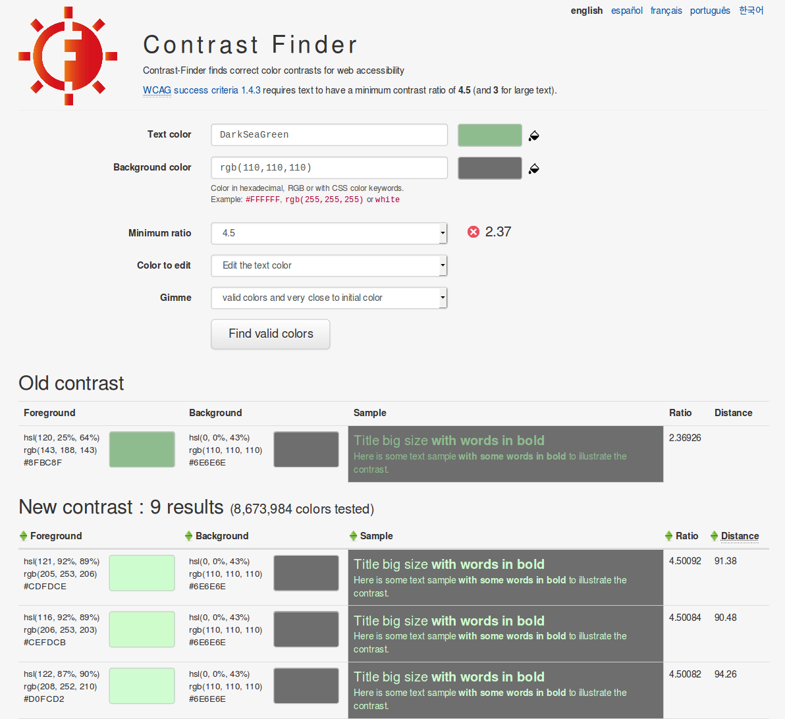

# Howto use

## What is Contrast Finder?

* Contrast Finder is a tool which computes the contrast between two colors (background, foreground) and checks if the contrast is valid.
* When the contrast is not valid, the main target is to suggest some correct colors contrasts.

Contrast finder is designed to be used by webdesigners, webdeveloppers or e-accessibility professionals.

## How to use this tool?

The interface is a form, with five fields.


## Text color

It is the foreground color. You can fill in this field with an hexadecimal value.
i.e. #AABBCC color (Note that #ABC works also, we automatically complete the field with #AABBCC).
You can also use this field without the '#'character, so FFF or FFFFFF works perfectly.
The input value is then previewed on the right of the field.

## Background color

This field works just like the text color field.

## Minimum ratio

Three possible values 3, 4.5 and 7.

How to choose a ratio? It depends on the following elements:

* Level of accessibility wanted: AA or AAA.
* Size of the text.
* Is the text bold or not?

### Level AA

Contrast ratios should be at least:

* 4.5 for body copy,
* 3 for text in bold with a font-size of at least (equivalent to) 18.5px or 120% of body copy,
* 3 for large text with a font-size of at least (equivalent to) 24px or 150% of body copy.


### Level AAA

For level AAA the logic is the same, only the ratios increase in the the following way:

* 4.5 ratio becomes 7
* 3 ratio becomes 4.5

Which means contrast ratios should be at least:

* 7 for body copy,
* 4.5 for text in bold with a font-size of at least (equivalent to) 18.5px or 120% of body copy,
* 4.5 for large text with a font-size of at least (equivalent to) 24px or 150% of body copy.

### Text size understanding

According to the W3C, 
> The ratio between sizes in points and CSS pixels is 1pt = 1.333px, therefore 14pt and 18pt are equivalent to approximately 18.5px and 24px.

Source: "Note 1" section in [Contrast (Minimum) Understanding SC 1.4.3](https://www.w3.org/TR/UNDERSTANDING-WCAG20/visual-audio-contrast-contrast.html)

So for a given default font-size of (equivalent to) 16px with the following CSS rules
```
body { font-size: 100%; }
p { font-size: 1rem; }
```
* the 14pt criteria can be understood as (equivalent to) 18.5px ...or 1.2em or 120% of the default size for body text,
* and the 18pt criteria can be understood as (equivalent to) 24px ...or 1.5em or 150% of the default size for body text.

**Please note** that these are pixel equivalences. In order to let users resize your text content, you should **never use fixed px unit** but relative units like **rem, em or %** to set your font sizes. Use your browser's Inspector/DevTools to check the calculated font size.

### Other info

All details about the contrast ratio:

* https://www.w3.org/TR/WCAG20/#visual-audio-contrast-contrast
* https://www.w3.org/TR/WCAG20/#contrast-ratiodef
* https://www.w3.org/TR/WCAG20/relative-luminance.xml

## Color to edit

It is either the text or background color. Default is text color.
The component you choose will be modified until we find a valid color.
The other color won't change.

##  Gimme/The algorithms

The first value is "Valid colors and very close to initial color". The result is a list of colors close to the original color. The aim is to have a valid color with a contrast as close to the selected ratio as possible (At the 0.001 range).

The second value is "A range of valid colors". The result is a wide range of colors.
This algorithm is very helpful if you are not sure about the hue of your initial color.

More informations about [the algorithms](The-algorithms.md) here.


