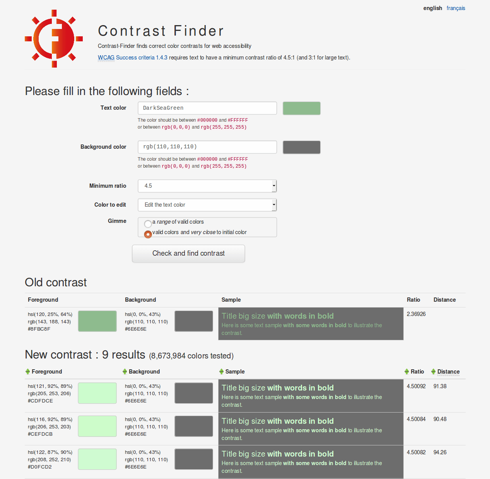

 

# Contrast-Finder documentation

## Contrast-Finder

* Tool to provide color combination for a good (accessible, WCAG-compliant) contrast.
* This helps you in satisfying web accessibility (a11y) tests on contrasts:
  * [WCAG Success Criteria 1.4.3](http://www.w3.org/TR/WCAG20/#visual-audio-contrast-contrast)
  * [WCAG Success Criteria 1.4.6](http://www.w3.org/TR/WCAG20/#visual-audio-contrast7)
  * [RGAA test 3.3 (in french)](http://references.modernisation.gouv.fr/rgaa-accessibilite/criteres.html#crit-3-3)
  * [RGAA test 3.4 (in french)](http://references.modernisation.gouv.fr/rgaa-accessibilite/criteres.html#crit-3-4)

## Documentation
* [Howto use](Howto-use.md)
* [Howto install](10_Install_doc/README.md)
* [Howto build](30_Contributor_doc/Build/README.md)

---
* More informations about the [algorithms](The-algorithms.md) here.
* [Other contrast tools](Other-contrast-tools.md)

## Screenshots

